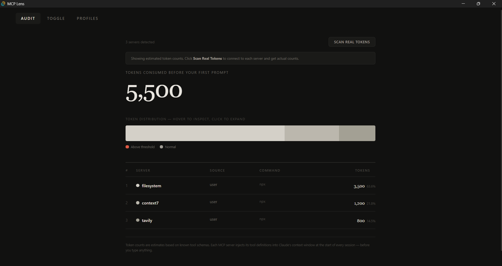
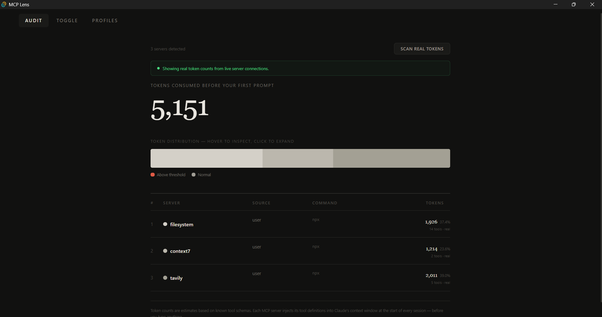
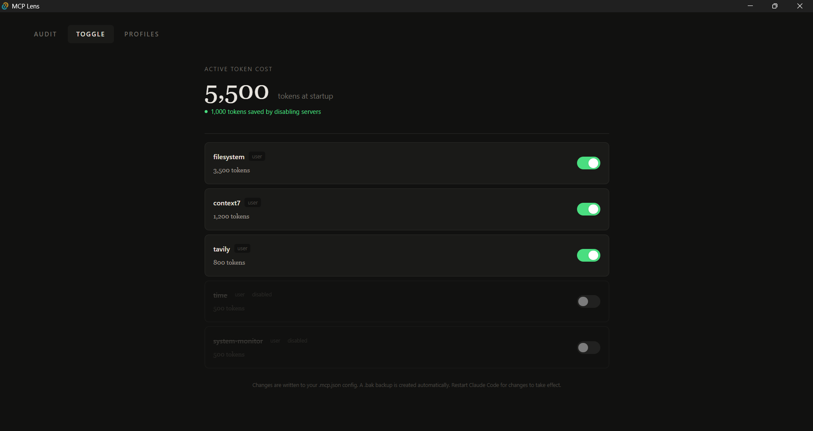
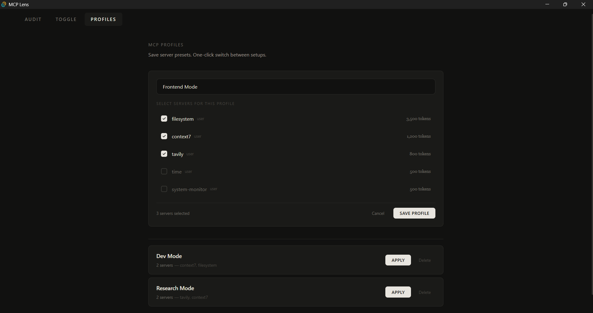

# MCP Lens

A desktop app that shows you how many tokens your MCP servers are silently eating before you even type your first prompt.

Every MCP server injects its tool definitions into your AI assistant's context window at the start of every session. One bloated server can burn 5,000-10,000 tokens before you've typed anything. MCP Lens makes this invisible cost visible — and lets you do something about it.

<!-- SCREENSHOT: App ka Audit screen with real token counts dikhao. Full window screenshot lena jisme hero number, stacked bar, aur table sab dikhe. -->


## Features

**Audit** — See exactly how many tokens each MCP server costs you per session.

<!-- SCREENSHOT: Audit tab ka screenshot with "Scan Real Tokens" button clicked, real counts visible -->


**Toggle** — Turn servers on/off with one click. Your config is updated automatically with a `.bak` backup every time.

<!-- SCREENSHOT: Toggle tab ka screenshot jisme ek server ON aur ek OFF dikhe. Green switch visible ho. -->


**Profiles** — Save named presets like "Frontend Mode" or "Research Mode". Switch your entire MCP setup in one click.

<!-- SCREENSHOT: Profiles tab ka screenshot jisme "New Profile" form khula ho with checkboxes. Ek saved profile bhi dikhe neeche. -->


**Real Token Scanning** — Connects to each MCP server, fetches its actual tool definitions, and counts real tokens. No more guessing.

## Supported Apps

MCP Lens scans config files from all major AI coding tools:

| App | Config Location |
|-----|----------------|
| Claude Code | `~/.mcp.json` |
| Claude Desktop | `%APPDATA%/Claude/claude_desktop_config.json` |
| Cursor | `~/.cursor/mcp.json` |
| Windsurf | `~/.codeium/windsurf/mcp_config.json` |
| VS Code Copilot | `.vscode/mcp.json` |

## Install

### Download (Windows)

Download the latest `.exe` from [Releases](https://github.com/thisissinghji/mcp-lens/releases). Double-click to install.

### Build from source

```bash
# Prerequisites: Node.js, Rust, Python (for real token scanning)
git clone https://github.com/thisissinghji/mcp-lens.git
cd mcp-lens
npm install
npm run tauri dev    # development
npm run tauri build  # production .exe
```

## How it works

```
App starts
  → Scans config files from all supported AI tools
  → Reads MCP server entries
  → Shows estimated token cost per server
  → "Scan Real Tokens" connects to each server,
    fetches tool definitions, counts actual tokens
```

When you toggle a server OFF:
- Server entry moves from `.mcp.json` to `.mcp-disabled.json`
- A `.bak` backup is created before every change
- Toggle it back ON anytime — nothing is deleted

## Tech Stack

- **Tauri 2.0** — Desktop app framework (2MB installer, not 150MB like Electron)
- **Rust** — Backend for file I/O, config parsing, token estimation
- **React + TypeScript** — Frontend UI
- **Tailwind CSS v4** — Styling with custom Swiss Editorial dark theme
- **Framer Motion** — Animations
- **Python** — Real token counting via MCP SDK client

## Token Counting

MCP Lens uses two methods:

1. **Estimated** (instant) — Known servers have hardcoded estimates based on typical tool counts. Unknown servers use a formula based on config size.

2. **Real** (scan required) — Connects to each server via MCP protocol, fetches the actual tool list, and counts tokens from tool names + descriptions + input schemas. ~4 characters = 1 token.

Note: Token counts are approximate. The exact tokenizer varies by model (Claude uses a different tokenizer than GPT). But relative comparisons between servers are accurate — which is what matters for identifying bloat.

## License

MIT
